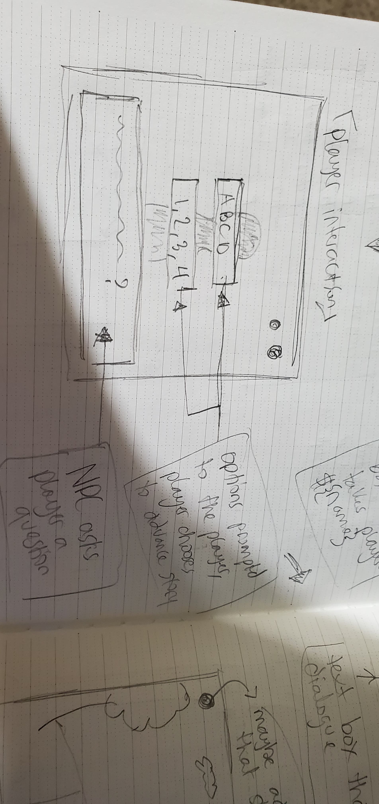
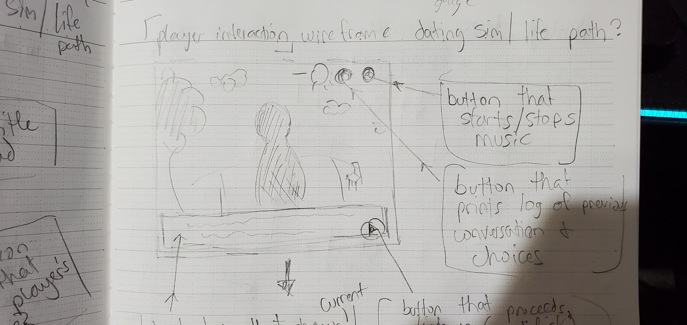
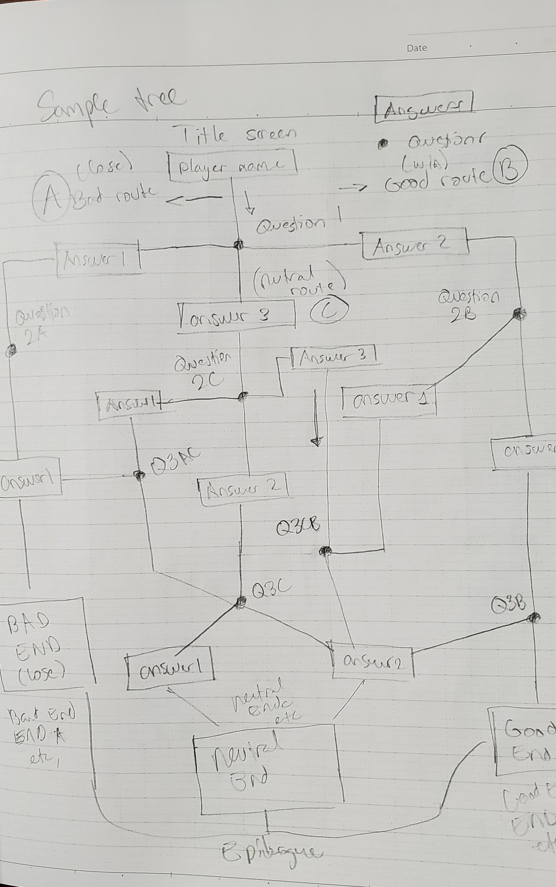

# Visual Novel - A Dog's Life

===========================

This project, titled "A Dog's Life" is a visual novel styled after old VNs and galge games from the 90's.

It features a rudimentary dialogue tree that the player with navigate by selecting choices, directing the flow of the story.

The goal is determined by the player, as their choices will affect the ending they recieve.

===========================

## User Story

>A user will

- [x] initialize the game through a title screen
- [x] reach between three endings
- [x] interact with the story by selecting a choice from a predetermined list
- [x] have the ability to pause or play by clicking a button on the game screen
- [x] advance text by clicking on the dialogue box
- [] press a button to view the background and character art (toggling the UI)
- [] access a log of all previous dialogue and player choices
- [] ~~be able to input their name for use in the game~~
- [] ~~view the character that the player is speaking to~~

## Win/Loss State

- player "wins" by reaching the good or neutral ending
- player "loses" by reaching the bad ending

## My Approach

- Write a short non-sense story
    - characters and locations will be fictional
    - assets used were found with Google images
- UI is made entirely with CSS
- Create a container to house the entire game
    - fill the container with a background selected through an array
- Manipulate the background music using JavaScript
    - music is selected through an array
- Manipulate the UI using JavaScript
    - each element will listen for clicks to respond to the player's actions
    - buttons that allow music to pause or play
- Advance and redirect the story using JavaScript in response to player choices
    - all dialogue is housed in arrays
- Write functions to keep the story scalable
    - one function can be used to advance all dialogue, no matter how long or short
    - one function can be used to cycle all art assets
    - one function can be used to access all music files

Initial Ideas/concepts:

## Future Goals

- expand the story to be longer/more detailed
- create a more robust cast of characters
- feature assets for characters other than the protagonist
- create art assets to be used in game
- offer more player choices and endings
- create a true route/ending